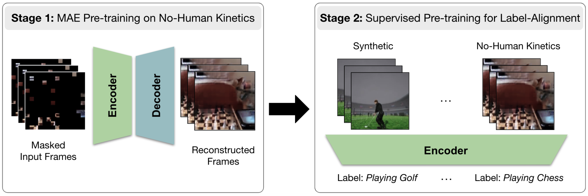

# Privacy-Preserving MAE Align (PPMA)
This repository contains instructions needed to recreate the benchmark detailed in the paper _Learning Human Action Recognition Representations Without Real Humans_ and the code to reproduce the results.

*Fig: Illustration of PPMA. Model first pretrained on  No-Human Kinetics with MAE followed by joint label-alignment pretraining on Synthetic data and No-Human Kinetics.*

Refer to <a href="data/">data/</a> for how to access the benchmark datasets.

Refer to <a href="code/">code/</a> for how to train models with PPMA and evaluate them on this benchmark.
